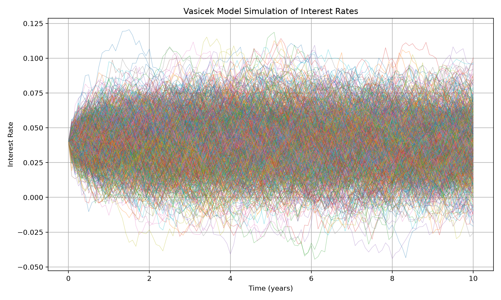
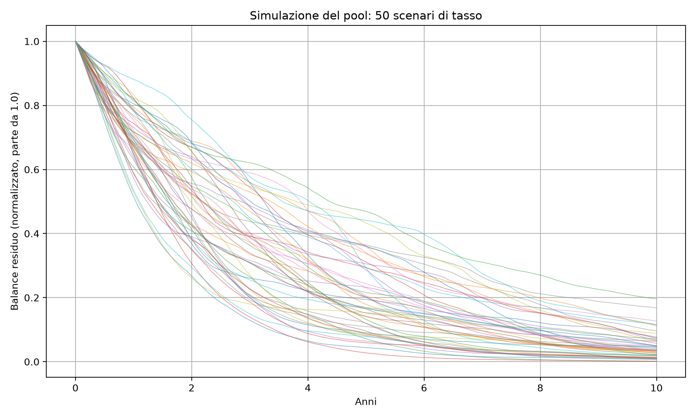
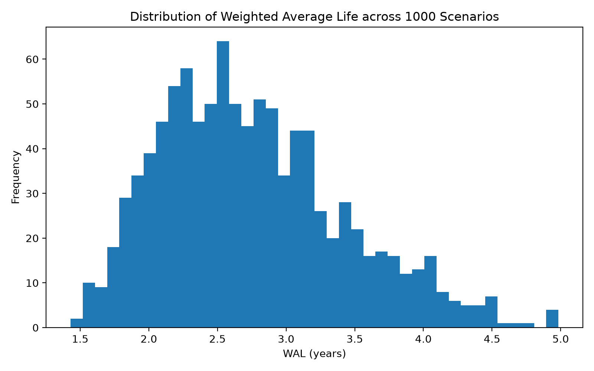
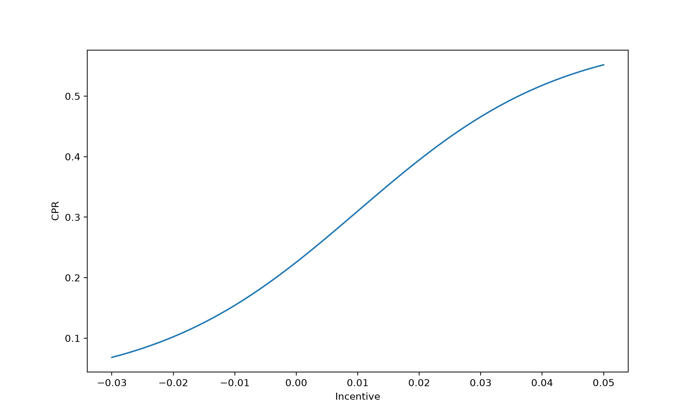

# Stochastic MBS Pool Model

Monte Carlo simulation of mortgage-backed securities (MBS) pool dynamics in Python. The project combines stochastic short-rate modeling, rate-driven prepayment, default assumptions, pool balance projection, and scenario-level Weighted Average Life (WAL) analysis.

## Motivation

This project grew out of my work as a Quantitative Analyst on a U.S. residential mortgage credit risk portfolio. It explores the pricing and structuring side of mortgage cashflows by modeling how a mortgage pool behaves under uncertain interest-rate paths and quantifying the prepayment risk faced by MBS investors.

## Methodology

### 1. Interest-rate simulation: Vasicek model

The short rate follows the Vasicek stochastic differential equation:

$$
dr(t) = \kappa(\theta - r(t))\,dt + \sigma\,dW(t)
$$

The model is discretized with Euler-Maruyama:

$$
r(t+\Delta t) = r(t) + \kappa(\theta-r(t))\Delta t + \sigma\sqrt{\Delta t}\,Z,
\quad Z \sim \mathcal{N}(0,1)
$$

### 2. Prepayment and default modeling

Prepayment is represented by a Conditional Prepayment Rate (CPR) driven by the refinancing incentive:

$$
\text{incentive}(t) = \text{note_rate} - r(t)
$$

The incentive is mapped to CPR with a logistic function bounded by `CPR_min` and `CPR_max`. Annual CPR is converted to the monthly SMM convention:

$$
\text{SMM} = 1 - (1 - \text{CPR})^{1/12}
$$

Default is modeled with a constant Conditional Default Rate (CDR), converted to a Monthly Default Rate (MDR) using the same annual-to-monthly convention.

### 3. Pool balance dynamics

For each simulated scenario, the normalized outstanding balance evolves as:

$$
\text{balance}(t) = \text{balance}(t-1)
\times (1-\text{SMM}(t))
\times (1-\text{MDR})
$$

The default and prepayment assumptions are applied across 1,000 simulated interest-rate paths.

### 4. Weighted Average Life

For each scenario, WAL summarizes the timing of principal returned to investors:

$$
\text{WAL} = \frac{\sum_t t \times \text{cashflow}(t)}{\sum_t \text{cashflow}(t)}
$$

The distribution of WAL across scenarios measures the uncertainty in the timing of principal repayment.

## Project Structure

```text
stochastic-mbs-model/
├── README.md
├── requirements.txt
├── src/
│   ├── plots.py              # Generate simulations and save visualizations
│   ├── rates.py              # Vasicek short-rate simulation
│   ├── prepayment.py         # CPR/SMM/MDR functions
│   └── pool_simulation.py    # Pool balance dynamics and WAL calculation
└── output/                   # Generated PNG plots
```

## How to Run

Create an environment and install the dependencies:

```bash
python -m venv .venv
source .venv/bin/activate
pip install -r requirements.txt
```

Generate the plots and WAL summary statistics:

```bash
python src/plots.py
```

The script writes the generated figures to `output/` and prints the mean, 5th percentile, and 95th percentile of WAL.

## Example Results

**Simulated interest-rate paths (Vasicek):**



**Pool balance under 50 simulated rate scenarios:**



**WAL distribution across 1,000 scenarios:**



**CPR response to refinancing incentive:**



## Limitations and Next Steps

- Scheduled amortization is not yet modeled; adding it would produce more realistic balance paths.
- Default is currently represented by a constant CDR. A natural extension is a rate- or macro-dependent default model.
- Sequential-pay tranche cashflow allocation is a planned next step toward a simplified structured-product model.

## Tech Stack

Python, NumPy, Matplotlib

## Author

Gaya Cocca - [LinkedIn](https://www.linkedin.com/in/gaya-cocca/)
